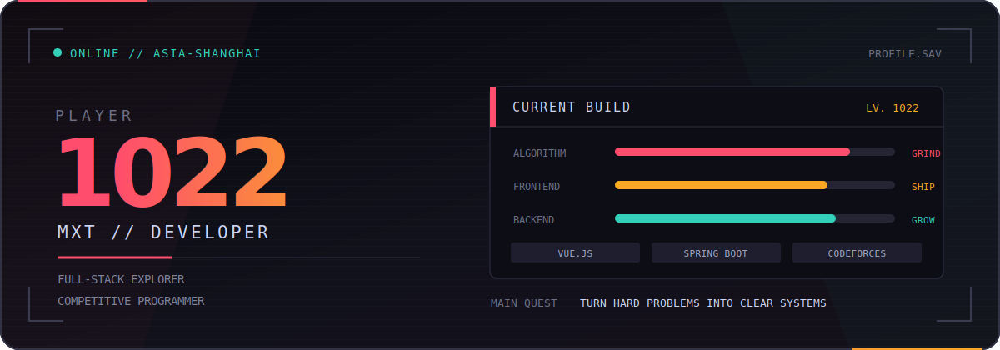

<div align="center">
  
</div>

<div align="center">
  <a href="https://github.com/mxt1022"></a>
  <a href="https://codeforces.com/profile/InsaneArrogant"></a>
  <a href="https://space.bilibili.com/48194734"></a>
  <a href="mailto:mxt1022@outlook.com"></a>
</div>

<br />

```ts
const mxt = {
  role: "Full-stack explorer & competitive programmer",
  focus: ["Vue.js", "Spring Boot", "system design"],
  principle: "Make it work. Make it clear. Make it memorable.",
  status: "turning coffee into commits ☕"
};
```

## Now / 正在发生

- 🧩 在 **Codeforces** 上训练算法思维，把复杂问题拆成可验证的小步骤
- 🛠️ 用 **Vue.js + Spring Boot** 构建从交互到服务端的完整体验
- 🌱 持续学习系统设计，关注可维护性、性能与开发者体验
- 🎮 代码之外：游戏、动漫，以及偶尔灵光一现的 side project

## Toolkit / 常用装备

<div align="center">
  
</div>

## Signals / 开发信号

<div align="center">
  
  
</div>

<br />

<div align="center">
  <a href="https://codeforces.com/profile/InsaneArrogant">
    
    
  </a>
</div>

## Activity / 最近在写

<!--START_SECTION:waka-->
<!--END_SECTION:waka-->

<div align="center">
  <picture>
    <source media="(prefers-color-scheme: dark)" srcset="https://raw.githubusercontent.com/mxt1022/mxt1022/output/github-contribution-grid-snake-dark.svg" />
    <source media="(prefers-color-scheme: light)" srcset="https://raw.githubusercontent.com/mxt1022/mxt1022/output/github-contribution-grid-snake.svg" />
    
  </picture>
</div>

---

<div align="center">
  <sub>Build quietly. Ship thoughtfully. Keep the graph green.</sub><br />
  <sub>来自中国 · UTC+8</sub>
</div>
